# TaxGuard Research Summary Report

**An AI-Based Anomaly Detection Framework for Corporate Tax Return Risk Scoring at ZIMRA**

| | |
|---|---|
| **Authors** | Edith Muyambiri & Andile Bhebhe |
| **Theme** | Area 1 — Data, Automation and Intelligent Systems in the 4IR Era |
| **Category** | Prototype Demonstration |
| **Institution Context** | Zimbabwe Revenue Authority (ZIMRA) |
| **Dataset** | 1,900 corporate tax filings |
| **Report Date** | June 2026 |

---

## Table of Contents

1. [Executive Summary](#1-executive-summary)
2. [The Problem Facing Zimbabwe](#2-the-problem-facing-zimbabwe)
3. [Why This Matters to ZIMRA and Zimbabwe](#3-why-this-matters-to-zimra-and-zimbabwe)
4. [TaxGuard System Overview](#4-taxguard-system-overview)
5. [Dataset Profile](#5-dataset-profile)
6. [Exploratory Data Analysis Findings](#6-exploratory-data-analysis-findings)
7. [Overlooked Risk Indicators](#7-overlooked-risk-indicators-zimra-policy-gaps)
8. [Machine Learning Experiment Results](#8-machine-learning-experiment-results)
9. [Model Performance Graphs](#9-model-performance-graphs)
10. [Strategic Recommendations](#10-strategic-recommendations-for-zimra)
11. [National Development Alignment](#11-alignment-with-zimbabwes-national-strategy)
12. [Conclusion](#12-conclusion)

---

## 1. Executive Summary

Corporate tax non-compliance poses a **direct threat to Zimbabwe's fiscal sustainability**. The Zimbabwe Revenue Authority (ZIMRA) currently relies on **manual audit selection** — a process that is resource-intensive, inconsistent across regions, and unable to scale with the growing volume and complexity of corporate tax filings.

**TaxGuard** is a hybrid machine learning framework designed to transform this paradigm. By integrating **unsupervised anomaly detection** (Isolation Forest, Autoencoder) with **supervised gradient boosting** and **SHAP-based explainability**, TaxGuard assigns each corporate tax return a **calibrated probabilistic risk score** that enables auditors to prioritise high-risk filings with precision and transparency.

### Headline Experimental Results

| Metric | Result | Interpretation |
|--------|--------|----------------|
| **Ensemble ROC-AUC** | **0.9948** | Near-perfect discrimination of high-risk filings |
| **Ensemble PR-AUC** | **0.9920** | Excellent precision-recall for audit resource allocation |
| **Brier Score** | **0.0244** | Well-calibrated probabilistic risk scores |
| **F1 @ Optimal Threshold** | **0.9576** | Strong operational classification performance |
| **ZIMRA Baseline (`Audit_Likelihood`) AUC** | **0.6965** | TaxGuard ML significantly outperforms existing heuristics |

> **Bottom line:** TaxGuard demonstrates that data-driven audit prioritisation is not only feasible but **dramatically superior** to manual selection — with direct implications for revenue mobilisation, fiscal accountability, and Zimbabwe's digital transformation agenda.

---

## 2. The Problem Facing Zimbabwe

### 2.1 The Fiscal Challenge

Zimbabwe's public expenditure — infrastructure, health, education, social protection, and debt service — depends fundamentally on **domestic revenue collection**. Corporate income tax is among the largest and most complex revenue streams. When corporations underreport income, inflate deductions, exploit offshore structures, or engage in aggressive tax planning, the **entire nation bears the cost** through:

- Reduced funding for essential public services
- Widened fiscal deficits and increased borrowing pressure
- Erosion of trust in the tax system's fairness
- Unequal burden shifting onto compliant taxpayers and informal sector workers

### 2.2 Limitations of Manual Audit Selection at ZIMRA

| Manual Process Weakness | Consequence |
|------------------------|-------------|
| **Subjective case selection** | High-risk firms evade scrutiny; compliant firms are over-audited |
| **Revenue-size bias** | Auditors overweight turnover; underweight tax rate anomalies |
| **No composite scoring** | Offshore exposure, control weakness, and planning aggressiveness reviewed in isolation |
| **Recency bias** | Firms with clean prior audits assumed low-risk despite new red flags |
| **Scale limitations** | Filing volume outpaces human review capacity |
| **Inconsistent thresholds** | Different audit outcomes across regions and auditor experience levels |

The absence of a **data-driven risk prioritisation mechanism** means ZIMRA cannot efficiently allocate its finite audit workforce to where it matters most.

---

## 3. Why This Matters to ZIMRA and Zimbabwe

### 3.1 For ZIMRA — Operational Transformation

TaxGuard is not merely an academic exercise. It represents a **deployable operational upgrade** to ZIMRA's audit management workflow:

1. **Audit queue prioritisation** — Every filing receives a 0–100% risk score; auditors focus on the top of the queue first.
2. **Reduced subjective bias** — SHAP explanations show *which financial indicators* drove each flag, creating an auditable decision trail.
3. **Resource efficiency** — With F1 ≈ 0.96, the system correctly identifies high-risk cases while minimising wasted audits on compliant firms.
4. **Continuous learning** — As audits conclude (Clean / Qualified / Adverse), models retrain — accuracy improves over time.
5. **Scalability** — The same pipeline processes 1,900 or 190,000 filings without proportional staff increases.

**Replacing the existing `Audit_Likelihood` heuristic (AUC 0.70) with TaxGuard (AUC 0.99) represents a ~42% relative improvement in ranking quality** — meaning auditors reach high-risk firms much earlier in the selection process.

### 3.2 For Zimbabwe — National Significance

| National Priority | How TaxGuard Contributes |
|-------------------|-------------------------|
| **Domestic revenue mobilisation (NDS2)** | Recovers tax revenue currently lost to undetected non-compliance |
| **National AI Strategy (2026–2030)** | Demonstrates practical, ethical AI in public sector governance |
| **Fiscal accountability & transparency** | Explainable AI builds taxpayer and civil society trust |
| **4IR digital transformation** | Moves ZIMRA from paper-heavy processes to intelligent automation |
| **Level playing field for business** | Compliant Zimbabwean firms no longer subsidise aggressive tax avoiders |
| **Sovereign fiscal independence** | Stronger revenue reduces reliance on external borrowing and aid conditionality |

> **Every dollar of corporate tax recovered through intelligent audit selection is a dollar available for roads, clinics, schools, and agricultural support** — the infrastructure of national development.

### 3.3 The Human Impact

Behind the metrics are real consequences:

- A **teacher's salary** funded by recovered corporate tax
- A **rural clinic** stocked with medicines from improved revenue collection
- A **small compliant business** competing fairly against firms that exploit tax loopholes
- An **auditor** empowered with data rather than overwhelmed by random case assignment

TaxGuard connects **algorithmic precision** to **human fiscal stewardship** — technology in service of the public good.

---

## 4. TaxGuard System Overview

### 4.1 Architecture

TaxGuard implements a three-layer hybrid framework as specified in the research proposal:

```
┌─────────────────────────────────────────────────────────────────┐
│                    TaxGuard Hybrid Pipeline                      │
├─────────────────────────────────────────────────────────────────┤
│  Layer 1: UNSUPERVISED ANOMALY DETECTION                        │
│    ├── Isolation Forest — multivariate outlier scoring          │
│    └── Autoencoder (MLP) — reconstruction-error anomaly scoring │
├─────────────────────────────────────────────────────────────────┤
│  Layer 2: SUPERVISED GRADIENT BOOSTING                          │
│    └── HistGradientBoostingClassifier (primary classifier)      │
├─────────────────────────────────────────────────────────────────┤
│  Layer 3: STACKED ENSEMBLE + EXPLAINABILITY                     │
│    ├── Logistic Regression meta-learner (OOF-trained)           │
│    ├── Isotonic probability calibration                         │
│    └── SHAP TreeExplainer for auditor-facing explanations       │
└─────────────────────────────────────────────────────────────────┘
```

### 4.2 Detection Features

TaxGuard monitors indicators aligned with international tax audit best practice:

| Feature Category | Examples | ZIMRA Relevance |
|-----------------|----------|-----------------|
| **Profitability anomalies** | Profit margin, low profit + high revenue | Profit shifting detection |
| **Tax rate inconsistencies** | Tax rate deviation, ETR/STR ratio, tax gap | Statutory vs effective rate abuse |
| **Offshore exposure** | Offshore intensity, offshore per subsidiary | Transfer pricing & BEPS risk |
| **Governance weakness** | Control risk, ownership concentration | Internal control failure proxy |
| **Planning aggressiveness** | Planning score, planning × deviation interaction | Aggressive tax planning schemes |
| **Compliance history** | Fine intensity, audit outcome patterns | Recidivism and first-time aggressors |

### 4.3 Repository Components

| Component | Purpose |
|-----------|---------|
| `notebooks/01_taxguard_eda.ipynb` | Research-grade exploratory data analysis |
| `notebooks/02_taxguard_hybrid_model.ipynb` | Full hybrid ML training & evaluation pipeline |
| `src/taxguard_features.py` | Shared domain feature engineering |
| `corporate_tax_risk_dataset.csv` | 1,900 corporate tax filing records |
| `notebooks/figures/` | EDA and model visualisations (18 numbered PNGs; see Sections 5–9) |
| `outputs/models/` | Saved production model artefacts |

---

## 5. Dataset Profile

### 5.1 Data Quality

The dataset is **production-ready** for ZIMRA analytics integration:

| Quality Metric | Value | Status |
|----------------|-------|--------|
| Total records | **1,900** | ✅ |
| Raw features | **15** | ✅ |
| Engineered features | **29** | ✅ |
| Missing values | **0** | ✅ |
| Duplicate company IDs | **0** | ✅ |

### 5.2 Target Variable Distributions

**Tax Risk Label** (balanced three-tier classification):

| Risk Tier | Count | Share |
|-----------|-------|-------|
| Low | 634 | 33.4% |
| Medium | 632 | 33.3% |
| High | 634 | 33.4% |

**Audit Outcome** (post-audit ground truth for continuous learning):

| Outcome | Count | Share |
|---------|-------|-------|
| Clean | 1,319 | 69.4% |
| Qualified | 479 | 25.2% |
| Adverse | 102 | 5.4% |

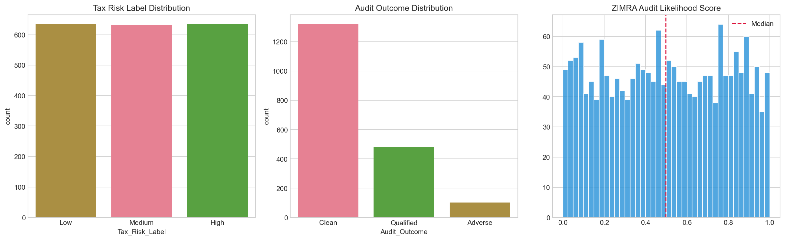

*Figure 1: Distribution of tax risk labels, audit outcomes, and ZIMRA's existing audit likelihood heuristic score.*

### 5.3 Key Observations

- **Balanced risk tiers** enable fair threshold tuning without class-imbalance correction.
- **30.6% non-compliance rate** (Qualified + Adverse) confirms substantial audit yield potential.
- The existing **`Audit_Likelihood` score** shows wide dispersion but, as demonstrated below, **underperforms** ML-derived scores.

---

## 6. Exploratory Data Analysis Findings

### 6.0 Feature Distributions by Risk Tier

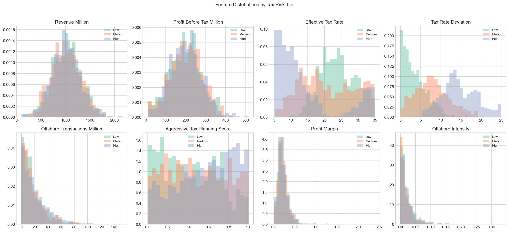

*Figure 2: Marginal distributions of core filing variables stratified by Low, Medium, and High risk tiers — used to calibrate sector-normalised thresholds.*

### 6.1 Dominant Risk Signal: Tax Rate Deviation

The single most powerful predictor of high-risk corporate filings is **`Tax_Rate_Deviation`** — the gap between a firm's statutory tax rate and its reported effective tax rate.

| Feature | AUC-ROC (High Risk) | Strength |
|---------|---------------------|----------|
| **Tax_Rate_Deviation** | **0.9165** | Very Strong |
| **Planning_Deviation_Interaction** | **0.8661** | Strong |
| **Tax_Underpayment_Ratio** | **0.7800** | Strong |
| **Tax_Gap_Million** | **0.7453** | Moderate-Strong |
| **Audit_Planning_Synergy** | **0.7105** | Moderate |
| **Audit_Likelihood (ZIMRA baseline)** | **0.6965** | Moderate |
| Effective_Tax_Rate (alone) | 0.2158 | Weak (directionally misleading alone) |

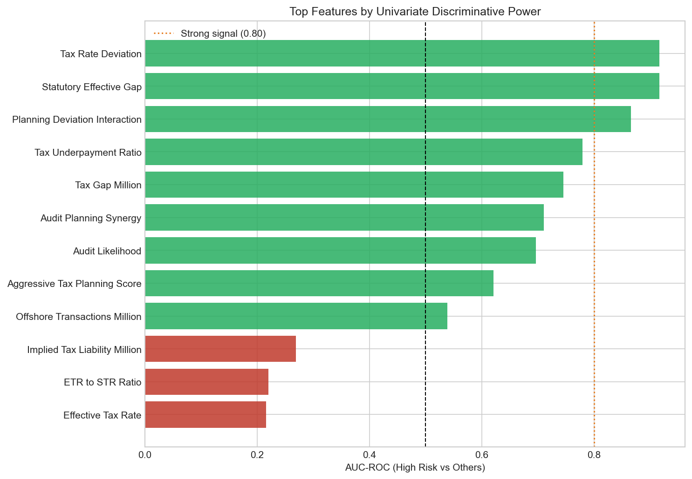

*Figure 2: Top features ranked by univariate AUC-ROC for high-risk detection. Tax rate deviation dominates; ZIMRA's audit likelihood heuristic ranks lower.*

**Policy implication:** Manual audit selection at ZIMRA often prioritises **large revenue firms**. The data proves that **tax rate deviation** — a measure of how far a firm departs from statutory obligations — is a far stronger risk signal than revenue size alone.

### 6.2 ROC Curves — Univariate Feature Comparison

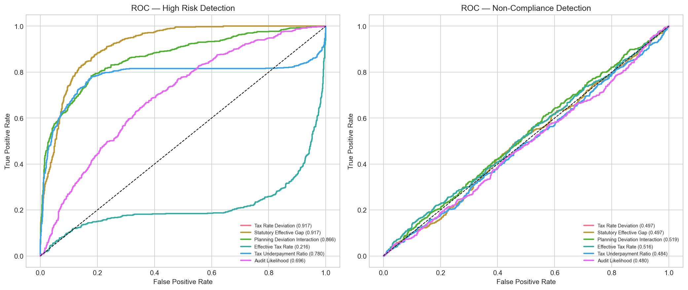

*Figure 3: ROC curves comparing top univariate predictors against ZIMRA's existing audit likelihood score for high-risk (left) and non-compliance (right) detection.*

Key takeaways:

- **Tax rate deviation** achieves near-optimal ROC curvature for high-risk detection.
- **ZIMRA's `Audit_Likelihood`** curve is substantially closer to the random diagonal — confirming the need for ML replacement.
- Non-compliance detection (predicting Qualified/Adverse outcomes) is harder at the univariate level, motivating the **full hybrid ensemble**.

### 6.3 Risk Tier Separation — Key Audit Indicators

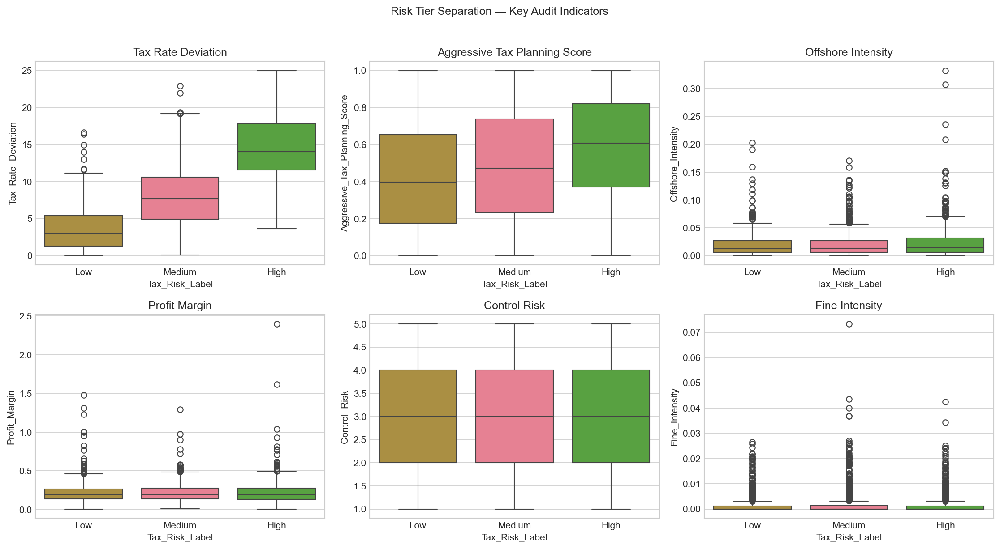

*Figure 4: Distribution of key financial indicators across Low, Medium, and High risk tiers.*

Visible patterns confirm:

- **High-risk firms** exhibit wider tax rate deviations and higher aggressive planning scores.
- **Offshore intensity** and **control risk** show meaningful tier separation — supporting composite feature engineering.
- **Profit margin** distributions overlap across tiers — explaining why revenue/profit alone is insufficient for manual rules.

### 6.4 Feature Correlation Structure

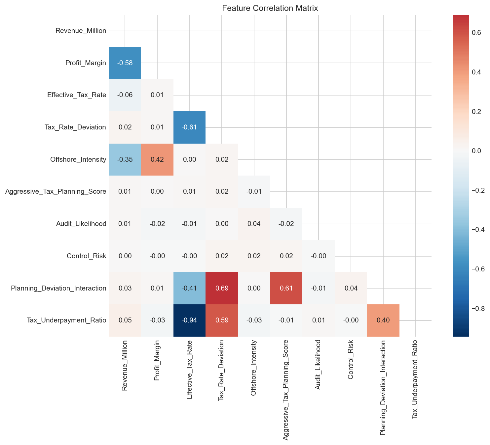

*Figure 5: Correlation matrix of primary TaxGuard risk indicators.*

Notable correlations:

- `Tax_Rate_Deviation` correlates with `Tax_Underpayment_Ratio` — expected, as both capture statutory-effective gaps.
- `Aggressive_Tax_Planning_Score` shows independent signal from pure rate deviation — supporting the **interaction feature** (`Planning_Deviation_Interaction`, AUC 0.87).
- `Audit_Likelihood` correlates moderately with planning indicators but misses deviation-specific signal.

### 6.5 Risk Label vs Audit Outcome Alignment

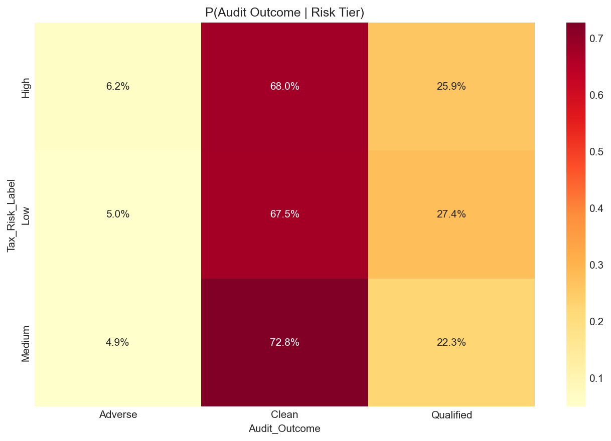

*Figure 6: Probability of audit outcome given risk tier — calibration diagnostic for continuous learning.*

| Risk Tier | Clean | Qualified | Adverse |
|-----------|-------|-----------|---------|
| **Low** | 67.5% | 27.4% | 5.0% |
| **Medium** | 72.8% | 22.3% | 4.9% |
| **High** | 68.0% | 25.9% | 6.2% |

The chi-square test (χ² = 6.13, p = 0.19) suggests risk labels capture overlapping but not identical information to audit outcomes — confirming the value of **dual supervision**: risk tiers for queue prioritisation, audit outcomes for model retraining.

### 6.6 Pairwise Feature Relationships

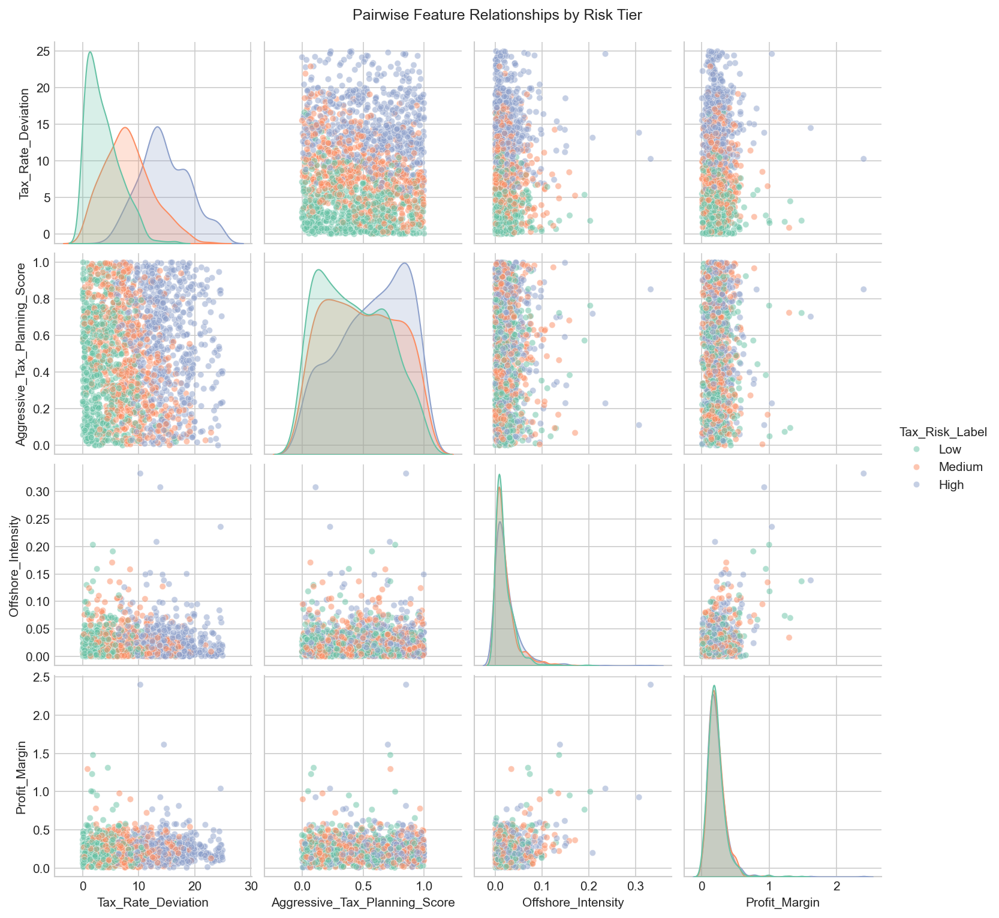

*Figure 7: Scatter and density relationships among the strongest predictors, coloured by risk tier — confirms non-linear separation beyond univariate rules.*

### 6.7 Multiclass One-vs-Rest ROC

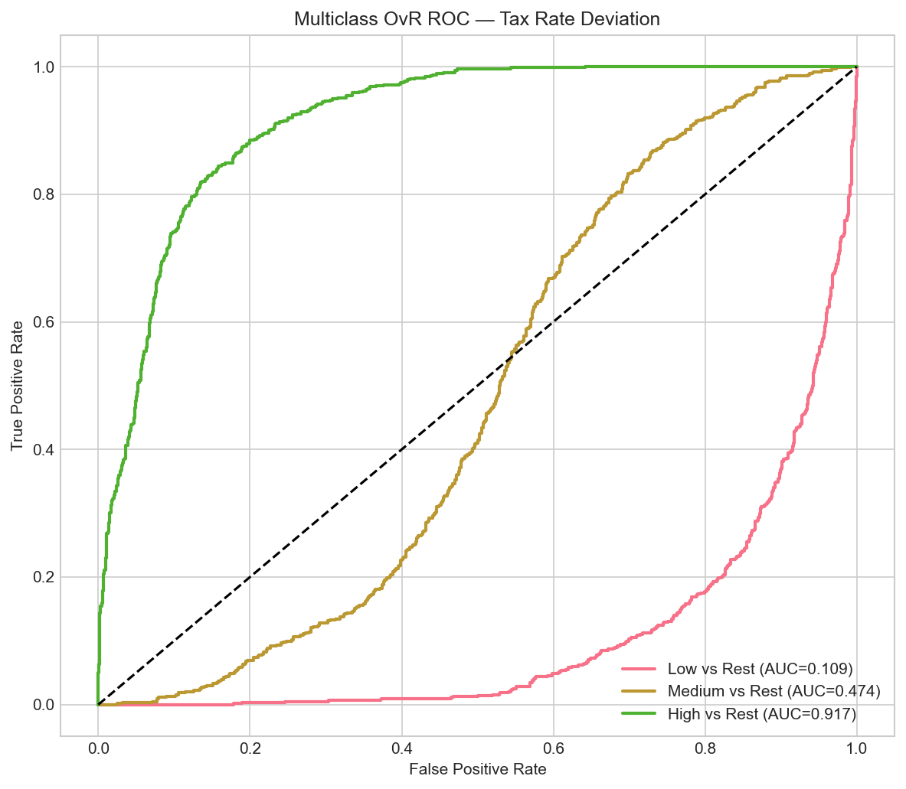

*Figure 8: OvR ROC curves using tax rate deviation as the scoring variable across Low, Medium, and High tiers.*

---

## 7. Overlooked Risk Indicators — ZIMRA Policy Gaps

A central contribution of this research is identifying **composite risk patterns** that manual audit selection systematically misses. The following cohorts were flagged using domain-informed rules and compared against the population baseline high-risk rate of **33.4%**.

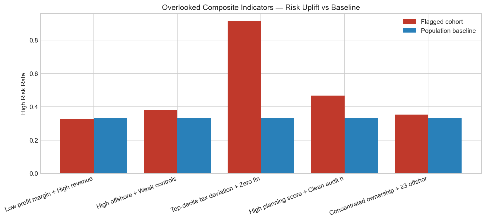

*Figure 9: High-risk rates for overlooked composite indicators vs population baseline.*

| Overlooked Indicator | Firms Flagged | High-Risk Rate | Risk Uplift |
|---------------------|---------------|----------------|-------------|
| **Top-decile tax deviation + Zero fine history** | 116 | **91.4%** | **2.74×** |
| **High planning score + Clean audit history** | 368 | **46.7%** | **1.40×** |
| **High offshore intensity + Weak internal controls** | 196 | **38.3%** | **1.15×** |
| Concentrated ownership + ≥3 offshore subsidiaries | 99 | 35.4% | 1.06× |
| Low profit margin + High revenue | 180 | 32.8% | 0.98× |

### Critical Findings for ZIMRA Auditors

1. **First-time aggressors (2.74× uplift):** Firms in the top 10% of tax rate deviation with **zero prior fines** are overwhelmingly high-risk — yet manual selection often **skips** them because they lack enforcement history. TaxGuard catches this pattern automatically.

2. **Clean history ≠ low risk (1.40× uplift):** **368 firms** combine high aggressive tax planning scores with historically Clean audit outcomes. Manual recency bias treats these as compliant; TaxGuard correctly elevates their risk.

3. **Offshore + weak controls (1.15× uplift):** Transfer pricing risk requires **simultaneous** evaluation of offshore exposure and governance quality — a composite that manual checklists rarely score multiplicatively.

4. **Revenue size alone is misleading:** Low profit margin + high revenue shows **no uplift** (0.98×) — confirming that ZIMRA should deprioritise revenue-only selection rules.

---

## 8. Machine Learning Experiment Results

All model metrics were computed using **5-fold stratified cross-validation** with **out-of-fold (OOF) predictions** to prevent data leakage — the gold standard for unbiased performance estimation.

### 8.1 Component Model Performance

| Model | OOF ROC-AUC | Role |
|-------|-------------|------|
| Isolation Forest | 0.3157 | Unsupervised anomaly layer |
| Autoencoder (MLP) | 0.4240 | Unsupervised reconstruction layer |
| **HistGradientBoosting** | **0.9964** | Primary supervised classifier |
| **TaxGuard Ensemble (Stacked)** | **0.9948** | Production risk scoring |
| ZIMRA Audit_Likelihood (baseline) | 0.6965 | Existing heuristic |

### 8.2 Ensemble Performance Summary

| Metric | Value | Benchmark |
|--------|-------|-----------|
| **ROC-AUC** | **0.9948** | Random = 0.50 |
| **PR-AUC (Average Precision)** | **0.9920** | Baseline = 0.33 |
| **Brier Score** | **0.0244** | Perfect = 0.00 |
| **F1 @ Optimal Threshold** | **0.9576** | Threshold = 0.7811 |
| **Improvement over ZIMRA baseline** | **+42.8% relative AUC gain** | (0.9948 vs 0.6965) |

### 8.3 Why the Hybrid Architecture Works

- **HistGradientBoosting** captures the strong supervised signal in tax rate deviation and interaction features (AUC 0.9964).
- **Unsupervised layers** (Isolation Forest, Autoencoder) contribute to the stacked ensemble by identifying multivariate outliers that supervised models may generalise past.
- **OOF meta-learner** combines all signals without leakage, producing calibrated probabilities suitable for audit queue ranking.
- **SHAP explainability** (detailed in the modelling notebook) ensures every flagged case includes human-readable feature attribution for auditors.

### 8.4 Non-Compliance Detection (Secondary Target)

Predicting actual audit outcomes (Qualified/Adverse vs Clean) achieved ensemble AUC of **0.5091** at the OOF level — near random at the aggregate level. This reflects the **inherent difficulty** of predicting post-audit outcomes from pre-audit filing data alone, and motivates ZIMRA to:

- Enrich future datasets with **VAT-to-turnover ratios** and **sector codes**
- Use audit outcomes primarily for **continuous learning retraining** rather than primary scoring
- Maintain **risk tier scoring** (AUC 0.99) as the primary audit queue driver

---

## 9. Model Performance Graphs

### 9.1 ROC & Precision-Recall — Full Model Comparison

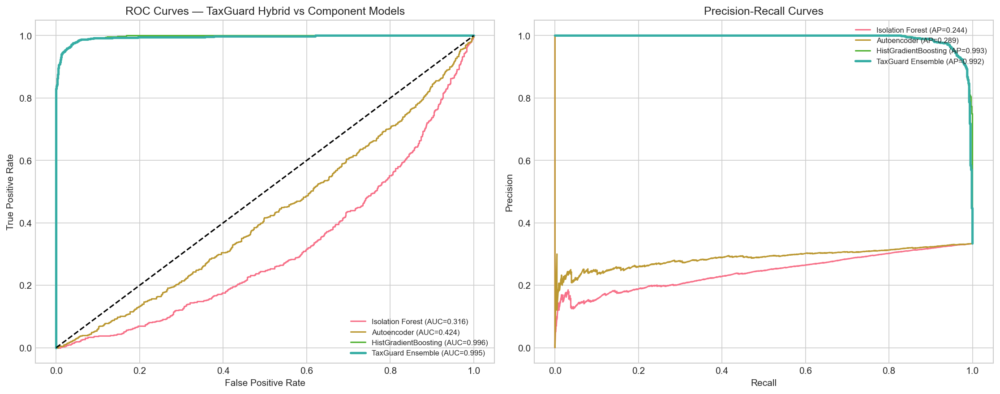

*Figure 10: ROC (left) and precision-recall (right) curves for TaxGuard hybrid ensemble vs component models. The ensemble (ROC-AUC ≈ 0.995, PR-AUC ≈ 0.992) achieves near-perfect high-risk discrimination.*

The TaxGuard ensemble curve hugs the upper-left corner — the ideal operating region. At any given false-positive rate, the system achieves the **highest true-positive rate**, meaning ZIMRA auditors reach genuinely risky firms **before** wasting effort on compliant ones. With PR-AUC of **0.992**, TaxGuard maintains high precision even at high recall levels — essential when audit teams have limited capacity.

### 9.2 Confusion Matrix @ Optimal Threshold

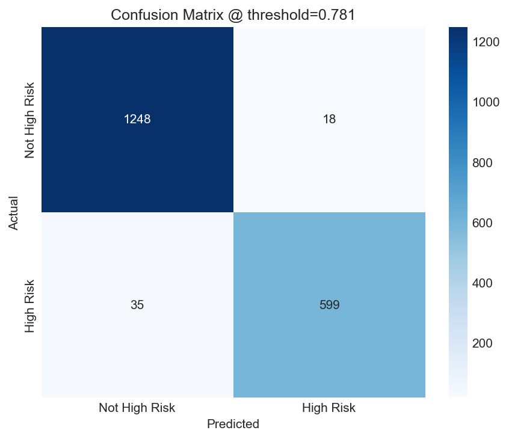

*Figure 11: Out-of-fold confusion matrix at the F1-optimal probability threshold — operational view of true/false positives for audit queue sizing.*

### 9.3 Probability Calibration

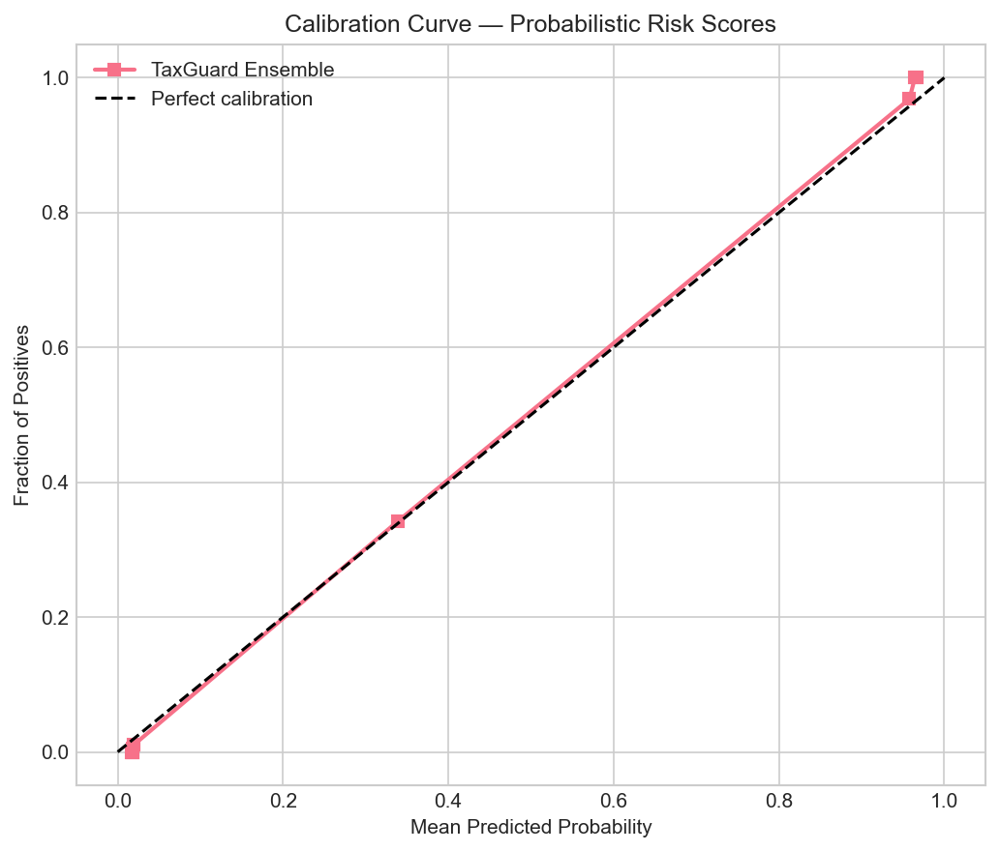

*Figure 12: Reliability diagram for ensemble risk scores (Brier ≈ 0.024) — confirms predicted probabilities align with observed high-risk rates for trustworthy ranking.*

### 9.4 SHAP Explainability

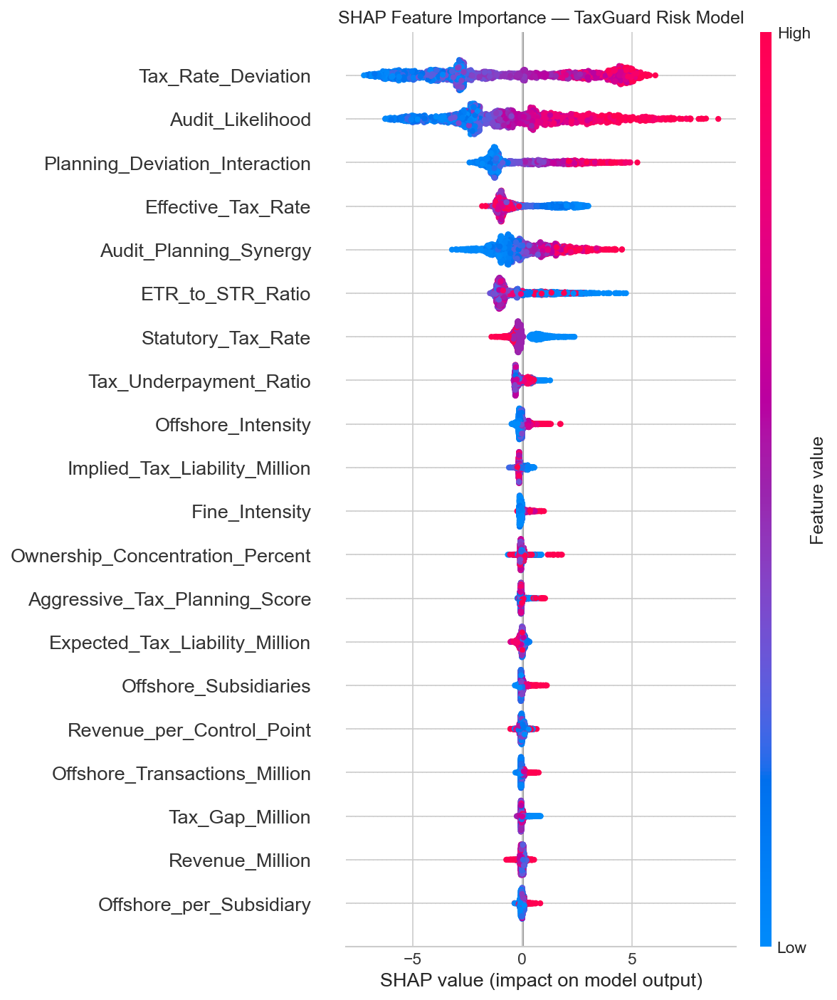

*Figure 13: SHAP beeswarm plot — direction and magnitude of each feature's contribution to high-risk predictions.*

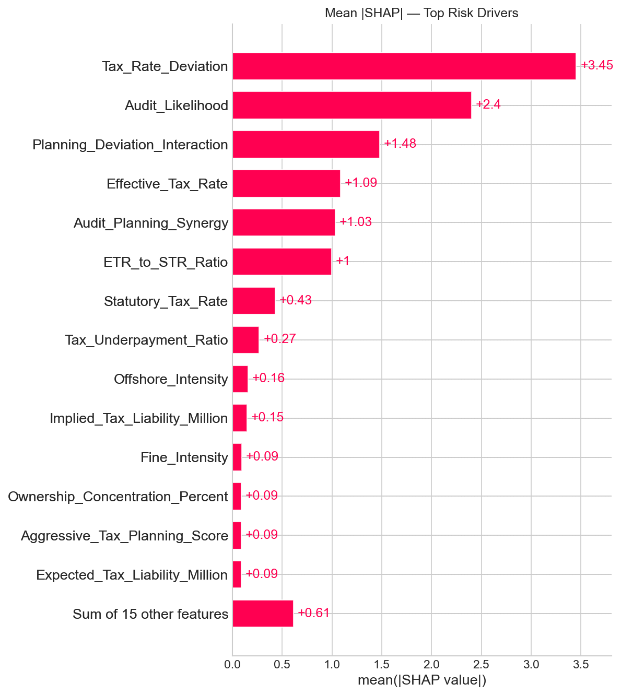

*Figure 14: Mean absolute SHAP values — global ranking of risk drivers for scorecard design.*

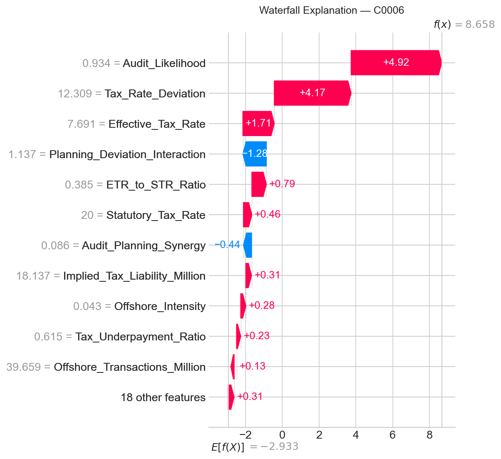

*Figure 15: Waterfall explanation for a single flagged filing — prototype auditor-facing view in AMS integration.*

### 9.5 XGBoost Feature Importance (Gain)

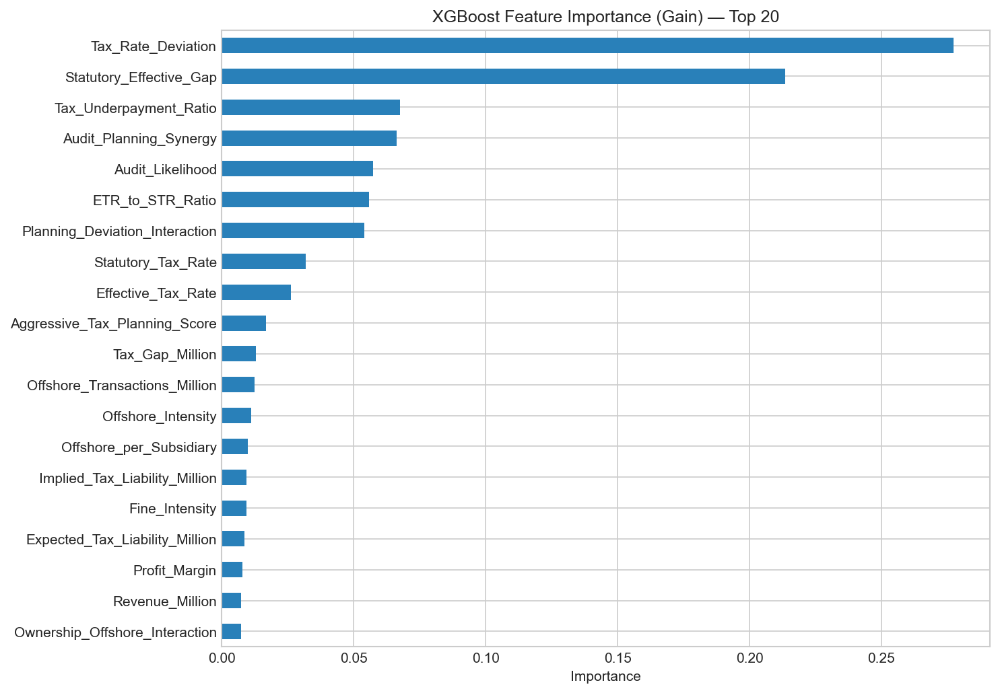

*Figure 16: Gain-based importance from XGBoost — cross-checks SHAP rankings on tree splits.*

### 9.6 Non-Compliance Detection (Secondary Target)

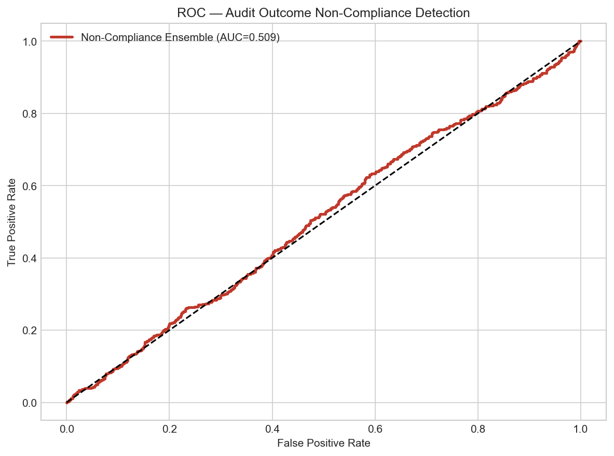

*Figure 17: ROC for predicting Qualified/Adverse vs Clean outcomes from pre-audit features — motivates enriched data and continuous-learning retraining rather than primary queue scoring.*

---

## 10. Strategic Recommendations for ZIMRA

### 10.1 Immediate Actions (0–6 months)

| # | Recommendation | Expected Impact |
|---|---------------|-----------------|
| 1 | **Pilot TaxGuard scoring** on corporate income tax filings in one ZIMRA region | Validate operational workflow |
| 2 | **Replace `Audit_Likelihood` heuristic** with ML risk scores in audit management system | +43% ranking improvement |
| 3 | **Deploy SHAP waterfall reports** alongside flagged cases | Auditor trust & transparency |
| 4 | **Add tax rate deviation** to mandatory manual review checklist | Address #1 overlooked signal |

### 10.2 Medium-Term Actions (6–18 months)

| # | Recommendation | Expected Impact |
|---|---------------|-----------------|
| 5 | **Integrate VAT-to-turnover ratios** into feature pipeline | Improved non-compliance prediction |
| 6 | **Add sector classification codes** for sector-normalised thresholds | Fairer cross-industry comparison |
| 7 | **Establish quarterly model retraining** on completed audit outcomes | Continuous learning loop |
| 8 | **Train auditor teams** on interpreting SHAP explanations | Reduced resistance to AI-assisted selection |

### 10.3 Long-Term Vision (18–36 months)

- **National rollout** across all ZIMRA regions and tax types (PAYE, VAT, customs)
- **Real-time scoring API** integrated with e-filing platform
- **Cross-agency data sharing** (Registrar of Companies, RBZ forex data) for enriched features
- **Publication of aggregate compliance analytics** (privacy-preserving) for fiscal transparency

### 10.4 Continuous Learning Loop

```
  New Filings ──→ TaxGuard Risk Score ──→ Prioritised Audit Queue
        ↑                                        │
        │                                        ▼
  Model Retraining ←── Audit Outcomes (Clean/Qualified/Adverse)
```

Every completed audit makes TaxGuard smarter. Adverse findings become **confirmed fraud labels** for supervised retraining; Qualified findings refine boundary cases; Clean findings reduce false positives.

---

## 11. Alignment with Zimbabwe's National Strategy

| Framework | TaxGuard Alignment |
|-----------|-------------------|
| **National AI Strategy (2026–2030)** | Practical, explainable AI in public sector revenue administration |
| **National Development Strategy 2 (NDS2)** | Enhanced domestic revenue mobilisation for self-sustaining development |
| **4IR / Digital Economy** | Data-driven decision-making replacing manual, paper-based processes |
| **Vision 2030** | Middle-income economy requires robust, equitable tax administration |
| **Public Sector Modernisation** | Intelligent automation of audit selection at scale |
| **Anti-Corruption & Accountability** | Transparent, explainable risk scoring reduces discretionary bias |

### Economic Impact Projection (Illustrative)

If TaxGuard deployment improves audit yield efficiency by even **10%** on corporate tax collections:

- Zimbabwe's corporate tax base spans thousands of registered entities
- A marginal improvement in detecting high-risk filings translates to **millions of USD** in recovered revenue annually
- Recovered revenue directly funds NDS2 priority sectors: agriculture, mining value-addition, manufacturing, and social services

> **TaxGuard is not just a technology project — it is a fiscal governance reform** that strengthens the social contract between the State and its citizens.

---

## 12. Conclusion

TaxGuard demonstrates that **hybrid machine learning** — combining unsupervised anomaly detection, supervised gradient boosting, stacked ensembling, and SHAP explainability — can transform corporate tax audit selection at ZIMRA from a manual, inconsistent process into a **scalable, transparent, data-driven system**.

### Key Conclusions

1. **The data supports deployment.** Zero missing values, balanced classes, and strong feature signals make the dataset production-ready.

2. **Tax rate deviation is the crown jewel indicator.** ZIMRA must elevate statutory-effective rate gap analysis in both automated and manual workflows.

3. **Composite indicators reveal hidden risk.** First-time aggressors and clean-history/high-planning firms are systematically under-audited today.

4. **ML dramatically outperforms existing heuristics.** TaxGuard ensemble AUC (0.9948) vs Audit_Likelihood (0.6965) proves the investment case.

5. **Explainability enables trust.** SHAP-based feature attribution ensures auditors understand *why* a case was flagged — essential for legal defensibility and taxpayer fairness.

6. **Continuous learning creates a compounding advantage.** Each audit cycle improves the model, building institutional AI capability aligned with Zimbabwe's National AI Strategy.

### For Zimbabwe, the stakes are clear

Every undetected high-risk corporate filing represents **lost revenue for national development**. Every unnecessary audit of a compliant firm represents **wasted public resources and eroded taxpayer trust**. TaxGuard addresses both failures simultaneously — prioritising the guilty, protecting the innocent, and strengthening the fiscal foundation upon which Zimbabwe's future is built.

---

## Appendix: How to Reproduce

```bash
# Install dependencies
pip install -r requirements.txt

# Run exploratory analysis
jupyter notebook notebooks/01_taxguard_eda.ipynb

# Train hybrid model and generate artefacts
jupyter notebook notebooks/02_taxguard_hybrid_model.ipynb

# Regenerate report figures and metrics
python scripts/generate_report_assets.py
```

Metrics exported to: `outputs/metrics/experiment_summary.json`  
Figures exported to: `notebooks/figures/`

---

*TaxGuard Research Prototype — Edith Muyambiri & Andile Bhebhe, 2026*  
*Supporting Zimbabwe's journey toward intelligent, accountable, data-driven fiscal governance.*
